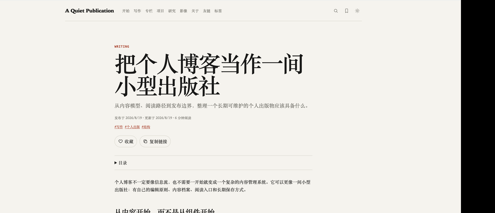
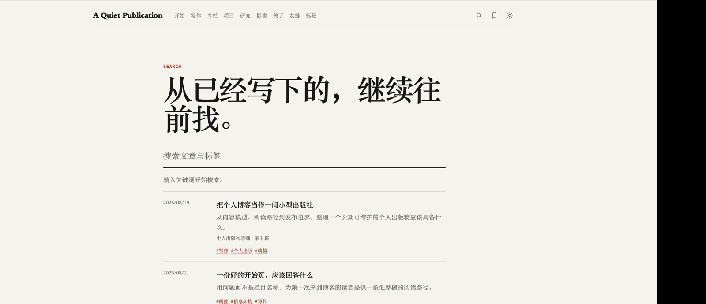
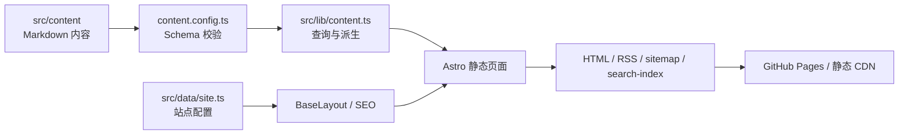

# Fourfold

> 一个静态优先、内容优先的个人出版物模板。

Fourfold 把个人博客从“文章列表”抽象成一套可长期维护的内容系统：写作是核心，专栏和标签负责发现，项目与研究提供作品档案，影像和友链扩展个人表达，搜索、收藏、RSS 和主题切换负责回访体验。

它参考了一个公开的编辑型个人出版物站点的信息架构，但不复制任何站点内容、品牌或个人资料。示例内容全部是中性占位内容，替换后即可作为自己的 blog 起点。

## 核心能力

- **写作档案**：Markdown/MDX 文章、年月 URL、年份归档、精选、最近更新、上一篇/下一篇。
- **长文体验**：自动目录、摘要、阅读时长、标签、相关文章、复制链接和本地收藏。
- **专栏**：以推荐顺序组织连续阅读，不把专栏误当成普通分类。
- **标签**：由文章 frontmatter 自动派生索引和聚合页。
- **项目**：支持 active、maintained、paused、archived 状态及项目类型。
- **研究**：支持 note/preprint 等类型、版本号、标签和代码/论文链接扩展位。
- **影像**：精选画廊索引与单个画廊详情。
- **开始页**：按读者问题提供入口，降低第一次访问的选择成本。
- **搜索**：构建期生成 `/search-index.json`，页面支持标题、摘要、正文和标签匹配，并将查询词同步到 `?q=`；无需后端。
- **收藏**：使用 `localStorage` 保存文章 URL；不需要账号，不上传数据。
- **主题**：CSS variables + 浏览器端明暗主题切换，并尊重系统主题。
- **发布基础设施**：RSS、sitemap、动态 robots、canonical、Open Graph、文章 `BlogPosting` JSON-LD、404。
- **内容校验**：`npm run validate:content` 检查必填字段、重复 translationKey、重复文章 URL、无效专栏和资源引用。
- **可访问性基础**：语义 HTML、Skip link、键盘焦点样式、按钮 `aria-pressed`。
- **可插拔边界**：评论、邮件订阅、云端收藏、统计和 CMS 保持为外部接入，不绑定具体供应商。

## 快速开始

```bash
npm install
npm run dev
```

打开 <http://localhost:4321>。生产构建：

```bash
npm run validate:content
npm run check
npm run build
npm run preview
```

部署前设置：

```bash
cp .env.example .env
# 修改 SITE_URL=https://你的域名
```

`astro.config.mjs` 会读取 `SITE_URL` 和 `BASE_PATH`：前者是域名，后者是可选的 GitHub Pages 仓库子路径。`src/data/site.ts` 使用同一 `SITE_URL`，用于 RSS、canonical、JSON-LD、Open Graph 与动态 robots。

GitHub Pages 有两种常见部署方式：

```env
# 用户站点或自定义域名：https://OWNER.github.io/
SITE_URL=https://OWNER.github.io
BASE_PATH=/

# 项目站点：https://OWNER.github.io/REPOSITORY/
SITE_URL=https://OWNER.github.io
BASE_PATH=/REPOSITORY
```

例如仓库名是 `astro-fourfold`，项目地址就是 `https://OWNER.github.io/astro-fourfold/`。不要把用户名写进模板源码；只在部署环境变量中配置。

## 你会得到什么

### 首页预览


### 文章详情预览



### 搜索预览



截图是本地中性示例内容，只用于说明页面层级和交互位置。

## 架构速览



完整的架构图、发布流程图、功能矩阵和运行时边界见 [`PROJECT.md`](PROJECT.md)。

项目 branding 文案见 [`docs/BRANDING.md`](docs/BRANDING.md)，社区介绍帖见 [GitHub Discussions #1](https://github.com/Liyuk/astro-fourfold/discussions/1)。

## Icon Design System

所有界面图标统一由 `src/components/chrome/Icon.astro` 提供：

- `24 × 24` viewBox；
- 统一 `1.7` 线宽、圆角端点和连接；
- 通过 `currentColor` 继承主题颜色；
- 只提供 `sm / md / lg` 三种尺寸；
- 搜索、收藏、主题、复制、分页和外链都使用同一套 SVG 图标；
- 不依赖第三方图标字体或 UI 框架。

完整图标清单、按钮 hit area、focus/hover 规则和视觉 token 见 [`PROJECT.md`](PROJECT.md)。

```text
src/
├── components/       可复用 UI：壳层、文章、目录、收藏、复制链接
├── content/          Markdown 内容集合
│   ├── writing/      写作
│   ├── columns/      专栏
│   ├── projects/     项目
│   ├── research/     研究
│   ├── photos/       影像
│   └── links/        友链
├── data/             站点配置、导航、UI 文案
├── layouts/          BaseLayout
├── lib/              内容查询、URL、收藏、主题工具
├── pages/            页面和 RSS endpoint
└── styles/           token、全局样式、正文样式
```

## 最先要改的地方

### 1. 站点身份：`src/data/site.ts`

修改：

- `name`、`title`、`description`
- `url`
- `author.name`、`author.bio`、`author.email`
- 社交链接和许可证
- 每页文章数、标签展示阈值
- `features` 开关

### 2. 内容：`src/content/`

删除示例 Markdown，按集合新增自己的内容。所有集合都会校验 frontmatter；不符合 schema 的内容会在 `npm run check` 中报错。

### 3. 导航：`src/data/navigation.ts`

调整一级导航的名称和顺序。页面路径目前对应：

```text
/              首页
/start/        开始
/writing/      写作
/writing/page/2/ 分页写作
/columns/      专栏
/projects/     项目
/research/     研究
/photos/       影像
/about/        关于
/links/        友链
/tags/         标签
/search/       搜索
/favorites/    收藏
/rss.xml       RSS
```

## 内容模型

### Writing

```yaml
---
title: "文章标题"
description: "列表、SEO 和 RSS 使用的摘要"
locale: zh-cn
translationKey: optional-stable-id
publishedAt: 2026-08-20
updatedAt: 2026-08-22
author: "作者"
tags: [主题一, 主题二]
featured: true
minutes: 8
column: "专栏名称"
columnOrder: 1
draft: false
---
```

`publishedAt` 决定年月 URL；列表默认按 `updatedAt ?? publishedAt` 倒序。`draft: true` 的内容不会进入公开列表、RSS 或 sitemap。

### Column

```yaml
---
title: "专栏名称"
description: "专栏解决什么问题，以及建议如何阅读。"
locale: zh-cn
slug: column-slug
order: 1
draft: false
---
```

文章通过 `column` 与 `columnOrder` 关联。专栏是连续阅读路径，标签是横向索引。

### Project / Research / Photo / Link

这些集合分别拥有自己的字段，但共享 `title`、`description`、`locale`、`draft`、`featured`、`translationKey` 等基础字段。完整约束见 `src/content.config.ts`。

## 设计边界

### 已内建的静态能力

页面、Markdown 渲染、内容索引、年份/标签/专栏派生、目录、相关文章、RSS、sitemap、robots、SEO 基础、搜索初版、主题和本地收藏都可以在静态部署上工作。

### 有意留作外部服务的能力

- **评论**：接入 Giscus、GitHub Discussions 或其他供应商；建议做成文章级开关。
- **邮件订阅**：接入 Buttondown、Mailchimp、ConvertKit 等；不要把具体供应商写进核心布局。
- **云端收藏**：当前仅本地收藏；需要跨设备同步时，以 `translationKey`/稳定内容 ID 为接口契约。
- **分析**：接入隐私友好的 Plausible、Umami 等，并独立于内容渲染。
- **CMS**：文章多起来后再接入 Git-based CMS 或管理后台，内容 schema 不需要改变。
- **全文搜索**：当前为轻量浏览器端匹配；文章达到数百/数千篇后可迁移到 Pagefind、MiniSearch 或托管搜索。

## 多语言扩展

当前 schema 已有 `locale` 和 `translationKey`。推荐的迁移策略是：

```text
src/content/writing/
├── hello-world.zh-cn.md
└── hello-world.en.md
```

实际接入中可以把 locale 放在 frontmatter，使用 `translationKey` 关联不同语言，再为 `[locale]` 增加路由层。模板目前把中文作为默认站点语言，英文字段已预留，避免在没有真实翻译内容时生成空的镜像页面。

## GitHub Pages 部署

仓库已经提供 `.github/workflows/deploy-pages.yml`。它会根据 GitHub 的实际仓库上下文自动计算：

```text
SITE_URL=https://实际用户名.github.io
BASE_PATH=/实际仓库名
```

因此源码里不需要写入你的 GitHub 用户名，也不需要把任何真实站点地址写进模板。部署前在仓库 Settings → Pages → Build and deployment 中选择 **GitHub Actions**，推送到 `main` 后工作流会生成并发布静态站点。

项目站点的访问地址通常是：

```text
https://你的用户名.github.io/你的仓库名/
```

如果使用自定义域名或用户站点，把 `BASE_PATH` 改为 `/`，并按 GitHub Pages 的域名设置配置 `SITE_URL`。

## 视觉原则

- 编辑化而非营销化：用标题、摘要、日期和分隔线建立秩序。
- 单列优先：长文宽度受控，列表可扫描，移动端自然降级。
- 内容优先：图片是内容类型，不是首页装饰必需品。
- 精选与最近分离：一个负责策展，一个负责表达活跃度。
- 专栏与标签分工：一个负责线性学习，一个负责横向探索。
- 少量客户端 JS：静态 HTML 仍可读，交互只在需要时加载。

## 发布建议

适合部署到：

- GitHub Pages
- Cloudflare Pages
- Netlify
- Vercel Static
- 任意支持静态目录的 CDN/对象存储

发布前：

1. 修改 `src/data/site.ts` 和 `.env` 的真实域名。
2. 替换 `public/og-default.svg` 与站点身份。
3. 删除所有示例内容。
4. 检查草稿、外链和图片 alt。
5. 运行 `npm run check && npm run build`。
6. 在真实域名上检查 RSS、sitemap、canonical、分享卡片和 404。

## 命名说明

Fourfold 表示四个互相支撑的维度：写作、项目、研究与个人表达。它不是固定的品牌方案；你可以把站点名、颜色、字体、文案和导航全部替换成自己的。
